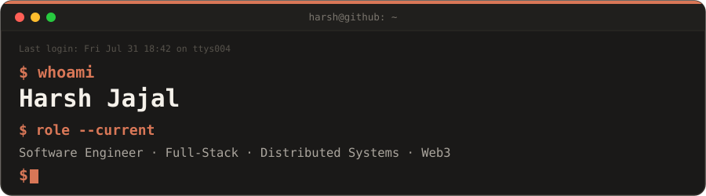

 

### `$ cat now.md`

Software engineer who likes owning things end-to-end — from a Solidity contract to the React app that talks to it. Currently building distributed, event-driven systems (Go, Kafka, Auth0) for a legal-tech platform. Before that: an invoicing suite, an on-chain certificate registry, and a computer-vision pipeline during an internship at Intel.

<table>
<tr>
<td width="50%" valign="top"></td>
<td width="50%" valign="top"></td>
</tr>
</table>

<h2>🛠️ Languages · Frameworks · Tools 🛠️</h2>

<picture>
  <source media="(prefers-color-scheme: dark)" srcset="https://skillicons.dev/icons?i=html%2Ccss%2Cjs%2Cts%2Cjava%2Csolidity%2Cgolang%2Cpy%2Creact%2Cnextjs%2Cnodejs%2Cexpress%2Celectron%2Ctailwind%2Cbootstrap%2Cmongodb%2Cpostgres%2Cprisma%2Cappwrite%2Cvercel%2Cnetlify%2Caws%2Cazure%2Cgcp%2Ckafka%2Cgit%2Cgithub%2Cpostman&theme=dark&perline=10"/>
  
</picture>

### `$ open ~/contact`

